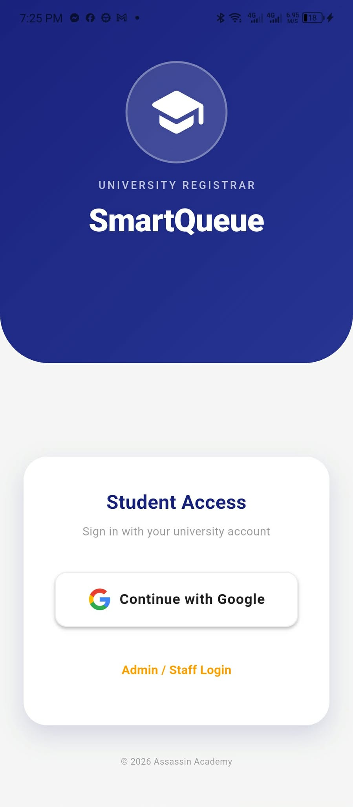
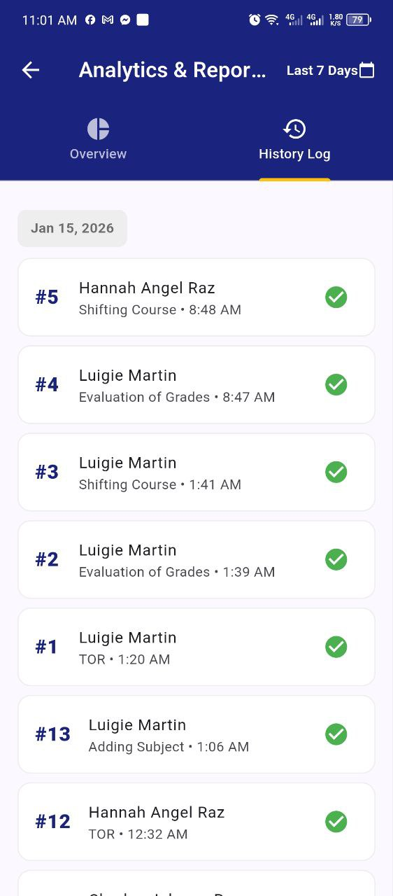
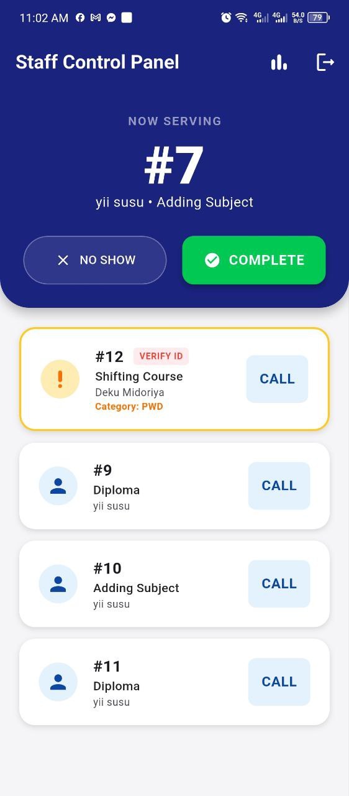
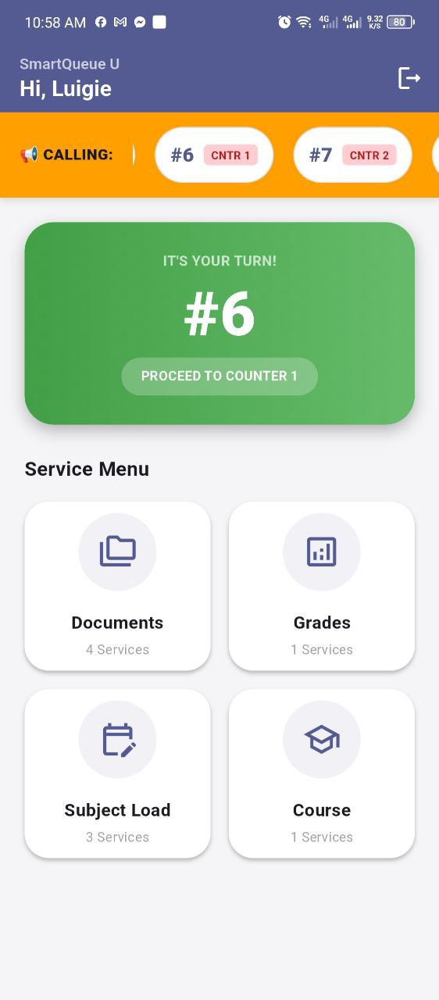

# SmartQueue: University Registrar Queue Management System 🎓

> **Status:** Active Development (Jan 2026)  
> **Tech Stack:** Flutter, Dart, Firebase (Firestore & Auth)

## 📖 Overview
**SmartQueue** is a mobile and web-based application designed to modernize the queuing process at the University Registrar's Office. It addresses the issue of physical congestion by allowing students to generate queue tickets remotely, track their status in real-time, and receive notifications when served.

This project implements a **Priority Queue Algorithm**, ensuring that PWDs, Senior Citizens, and Pregnant women are automatically sorted to the front of the line while maintaining fairness for regular transactions.

## ✨ Key Features

### 📱 Student App (Mobile)
* **Remote Ticketing:** Generate tickets for services like Transcript of Records, Diploma, etc.
* **Live Queue Ticker:** Real-time marquee display of "Now Serving" numbers across multiple counters.
* **Priority Logic:** Self-declaration for priority groups (PWD/Senior) with verification prompts.
* **Real-Time Alerts:** Local push notifications when the ticket status changes to "Serving".
* **Anti-Spam:** Prevents users from generating multiple active tickets simultaneously.

### 💻 Admin Dashboard (Web/Tablet)
* **Queue Control:** "Call", "Complete", and "No-Show" actions with instant database updates.
* **Concurrency Locking:** Prevents two counters from calling the same student at the same time.
* **Daily Reset:** Automated logic to reset ticket numbers (001) at the start of every business day.
* **Analytics:** Visual charts for service distribution and daily transaction volume.

## 🛠️ Architecture
The app follows a **3-Tier Architecture**:
1.  **Presentation:** Flutter (Mobile/Web)
2.  **Logic:** Client-side sorting algorithms & Firebase SDK
3.  **Data:** Google Cloud Firestore (NoSQL)

## 📸 Screenshots





## 🚀 Getting Started

### Prerequisites
* Flutter SDK (3.x or higher)
* Dart SDK
* Firebase Project Setup

### Installation
1.  **Clone the repository**
    ```bash
    git clone [https://github.com/dxlmartin00/SmartQueue.git](https://github.com/dxlmartin00/SmartQueue.git)
    cd smartqueue
    ```

2.  **Install dependencies**
    ```bash
    flutter pub get
    ```

3.  **Setup Firebase**
    * Add your `google-services.json` to `android/app/`
    * Add your `GoogleService-Info.plist` to `ios/Runner/`

4.  **Run the App**
    ```bash
    flutter run
    ```

## 📂 Project Structure
    android/ ├── build.gradle.kts # Android build configuration
             ├── local.properties # Local properties for Android
             ├── app/ ├── build.gradle.kts # App-specific build configuration
             ├── google-services.json # Firebase configuration for Android
             ├── src/ # Source code for Android
            
    ios/     ├── Runner/ # iOS app files
             ├── AppDelegate.swift # iOS app delegate
             ├── Info.plist # iOS app configuration
    
    lib/     ├── models/ # Data models (Ticket, User) 
             ├── services/ # Firebase & Notification logic 
             ├── widgets/ # Reusable UI components 
             ├── main.dart # Entry point 
             ├── student_dashboard.dart 
             └── admin_dashboard.dart
    
    test/ # Unit and widget tests
    web/ # Web-specific files
    linux/ # Linux-specific files
    macos/ # macOS-specific files
    windows/ # Windows-specific files

## 👨‍💻 Author
**Luigie Martin** BS Computer Science Student  
*North Eastern Mindanao State University - Lianga Campus*
*Assassin Academy 2026*